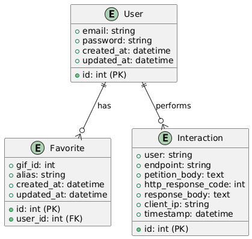

## Getting Started

### Prerequisites

- [Docker](https://www.docker.com/) and [Docker Compose](https://docs.docker.com/compose/)
- [Node.js](https://nodejs.org/) (if running outside Docker, Node 18+ recommended)
- [Composer](https://getcomposer.org/) (if running outside Docker)
- [VS Code](https://code.visualstudio.com/) with Dev Containers extension (Optional but recommended)

### Setup (Recommended: VS Code devcontainer)

1. **Open the project**
   Using VS Code, open the project and with Cmd+Shift+P(mac) or Ctrl+Shift+P(windows) show the command palette and choose "Dev Containers: Reopen in container".

   The container will automatically run `.devcontainer/setup.sh` to install dependencies.

2. **Set environment variables**
   Create a `.env` file and add the following fields
   - `APP_KEY=`
   - `PASSPORT_PERSONAL_ACCESS_CLIENT_ID=`
   - `PASSPORT_PERSONAL_ACCESS_CLIENT_SECRET=`
   - `GIPHY_KEY=`

3. **Run additional commands**
   Generate the applications key
   ```sh
   $ php artisan key:generate
   ```

   Set up the database
   ```sh
   $ php artisan migrate
   ```

   Generate passport keys
   ```sh
   $ php artisan passport:keys
   ```

   Generate the OAuth client by running:
   ```sh
   $ php artisan passport:client --personal
   ```
   and add the output values (`PASSPORT_PERSONAL_ACCESS_CLIENT_ID` & `PASSPORT_PERSONAL_ACCESS_CLIENT_SECRET`) manually into the `.env` file.


4. **Access the application:**
   - Web: [http://localhost:8000](http://localhost:8000)
   - phpMyAdmin: [http://localhost:8090](http://localhost:8090)


### Without VS Code and Dev Containers

1. **Start the development environment:**
   Run:
   ```sh
   $ docker compose -f .devcontainer/docker-compose.yml up --build
   ```
   and follow steps 2 & 3 from previous section.


### Manual Setup (Without Docker)

1. **Install dependencies:**
   ```sh
   $ composer install
   $ npm install
   ```

2. **Environment variables**
   Create `.env` file using `.env.example` as reference and fill the database credentials and other necessary fields.

2. **Generate application key:**
   ```sh
   $ php artisan key:generate
   ```

3. **Run migrations and seeders:**
   ```sh
   $ php artisan migrate --seed
   ```

4. **Generate Passport keys and client:**
   ```sh
   $ php artisan passport:keys
   $ php artisan passport:client --personal
   ```

6. **Start the development server:**
   ```sh
   $ php artisan serve
   ```

### Notes

- Set your `GIPHY_KEY` and other secrets in your `.env` file. Get an API key from [GIPHY](https://developers.giphy.com/dashboard)
- For API usage, see routes in [routes/api.php](routes/api.php).

### POSTMAN Collection

You can import the file `Laravel test.postman_collection.json` into postman

### UML

</a>

### Sequence Diagram

</a>

### Use Case Diagram

</a>

### ER Diagram

</a>